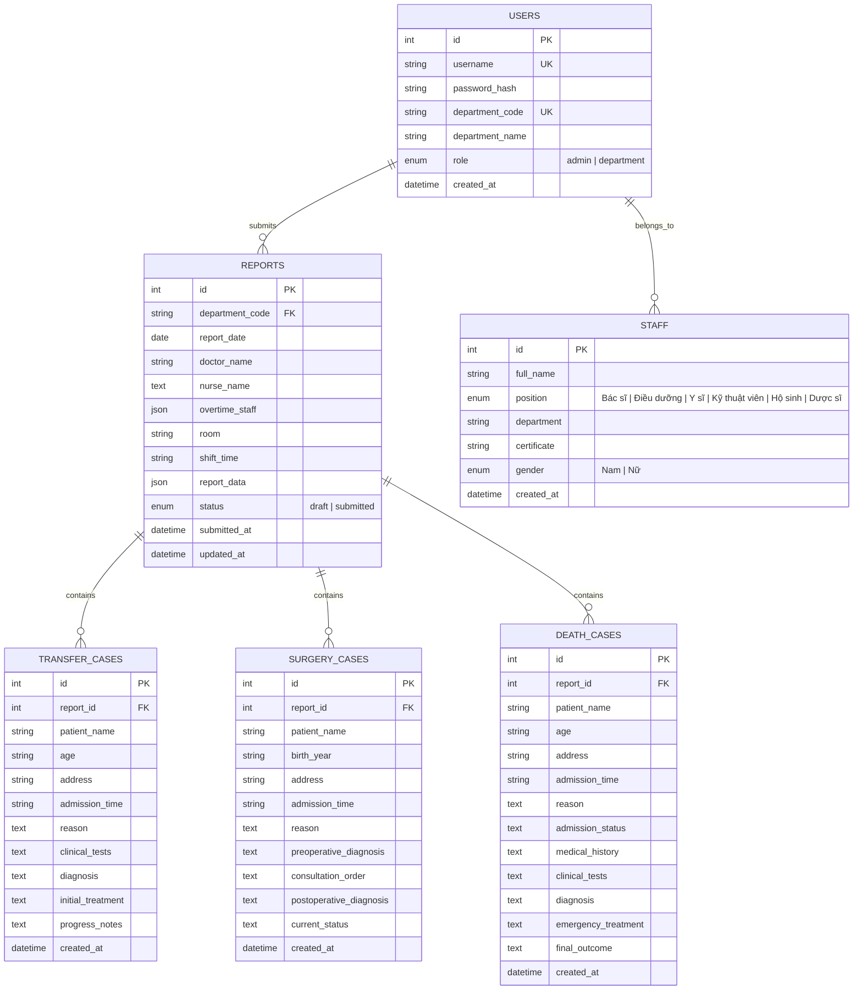

# 🏥 Hệ Thống Báo Cáo Giao Ban Trực Tuyến — TTYT Khu Vực Bình Long

<div align="center">


<br/>


### **HỆ THỐNG QUẢN LÝ, TỔNG HỢP VÀ TRÌNH CHIẾU BÁO CÁO GIAO BAN Y TẾ TOÀN DIỆN**

*Ứng dụng Web chuyển đổi số y tế toàn diện phục vụ 12 Khoa/Phòng chuyên môn & Phòng Kế Hoạch Nghiệp Vụ (KHNV) Trung Tâm Y Tế Khu Vực Bình Long.*

[](https://hospital-report-system.vercel.app/)
[-0F2C59?style=for-the-badge&logo=github)](https://github.com/UIBreaker/Hospital-Report-System)
[](https://hospital-report-system.vercel.app/)
[](LICENSE)

</div>

---

## 1. 🌟 Giới Thiệu & Bối Cảnh Dự Án

**Hệ Thống Báo Cáo Giao Ban Trực Tuyến** là giải pháp phần mềm chuyển đổi số y tế hiện đại, thay thế hoàn toàn phương thức báo cáo giao ban truyền thống bằng giấy tờ và file bảng tính rời rạc tại **Trung Tâm Y Tế Khu Vực Bình Long (Sở Y Tế Tỉnh Bình Phước)**.

Phần mềm được thiết kế đồng bộ theo chuẩn nhận diện thương hiệu y tế bệnh viện, cung cấp quy trình nhập liệu nhanh chóng cho các Bác sĩ & Điều dưỡng trực thuộc **12 khoa phòng chuyên môn**, đồng thời trang bị **Trợ lý Y Tế AI**, **thanh tìm kiếm nhân sự đánh số thứ tự thông minh**, **hỗ trợ nhiều điều dưỡng trực ca**, **tự động nạp lại báo cáo cũ khi chọn ngày**, **quản lý ca bệnh chuyển viện - phẫu thuật - tử vong khẩn cấp**, **xuất Excel đa Sheet chuyên nghiệp (`ExcelJS`)**, **in ấn chuẩn A4 & tải trực tiếp file PDF (`html2pdf.js`)**, cùng **chế độ trình chiếu giao ban toàn màn hình (Presentation Mode)** phục vụ các cuộc họp giao ban buổi sáng của Ban Giám Đốc.

---

## 2. 🛡️ Công Nghệ & Kiến Trúc Kỹ Thuật (Tech Stack)

<div align="center">


</div>

* **Frontend**:
  * **React 18** với **Vite 8** tối ưu hóa tốc độ build và Hot Module Replacement.
  * **React Router v7** điều hướng trang mượt mà (SPA).
  * **Axios** kết nối API với cơ chế Interceptor xử lý xác thực bảo mật.
  * **ExcelJS & html2pdf.js** xử lý xuất báo cáo Excel đa sheet và tài liệu PDF vector độ phân giải cao.
  * **Custom Design System & CSS Variables** với tone màu chuẩn Y Tế: Navy Blue (`#0F2C59`), Medical Red (`#D32F2F`), Botanical Green (`#2E7D32`).
* **Backend**:
  * **Node.js & Express 5** kiến trúc MVC hướng module hóa cao.
  * **MySQL2 Connection Pool** hỗ trợ kết nối bảo mật SSL đám mây (**Aiven Cloud / TiDB / Railway / XAMPP**), tích hợp `dateStrings: true` và `timezone: +07:00`.
  * **JSON Web Token (JWT)** xác thực bảo mật với cơ chế duy trì phiên làm việc **30 ngày**.
  * **Bcrypt** mã hóa mật khẩu một chiều tiêu chuẩn công nghiệp.
* **Testing & CI/CD**:
  * Bộ kiểm thử tự động **Playwright E2E** toàn diện (kiểm thử 13 tài khoản, kiểm thử cơ sở dữ liệu, kiểm thử luồng nghiệp vụ sâu).
  * Tự động triển khai liên tục qua **Vercel Serverless**.

---

## 3. 📋 Danh Sách 12 Khoa/Phòng Chuyên Môn Trong Hệ Thống

Hệ thống được thiết kế riêng biệt cho 12 chuyên khoa theo đúng chuẩn tổ chức của Trung Tâm Y Tế Khu Vực Bình Long:

| STT | Mã Khoa | Tên Khoa / Phòng | Tài Khoản Đăng Nhập | Đặc Điểm Nghiệp Vụ Chuyên Môn |
| :---: | :---: | :--- | :---: | :--- |
| **1** | `lck` | **Khoa Liên Chuyên Khoa** | `lck.bvbl` | Mắt, Tai Mũi Họng (TMH), Răng Hàm Mặt (RHM), Phẫu thuật chuyên khoa |
| **2** | `xn` | **Khoa Xét nghiệm** | `xn.bvbl` | Tổng số lượt xét nghiệm, BHYT, Nội trú, Ngoại trú, Huyết học, Sinh hóa, Vi sinh |
| **3** | `cdha` | **Chẩn đoán hình ảnh** | `cdha.bvbl` | Bảng kỹ thuật: CT Scan, X-quang, Siêu âm, Nội soi, ECG, HHK, BS trực phòng |
| **4** | `hscc_tnt` | **Hồi sức cấp cứu – Thận nhân tạo** | `hscctnt.bvbl` | Khối HSCC (thở máy, CPAP, oxy), Khối Thận nhân tạo (lọc máu), Phòng khám 21 |
| **5** | `noi` | **Khoa Nội** | `noi.bvbl` | Bệnh cũ, bệnh mới, xuất viện, chuyển khoa, tự động tính toán `Hiện còn` |
| **6** | `nhi` | **Khoa Nhi** | `nhi.bvbl` | Khám nhi, sơ sinh, thở oxy, chuyển viện, diễn biến nhi khoa |
| **7** | `nhiem` | **Khoa Nhiễm** | `nhiem.bvbl` | Sốt xuất huyết, tay chân miệng, truyền nhiễm, phòng cách ly |
| **8** | `san` | **Khoa Sản** | `san.bvbl` | Sinh thường, mổ đẻ (mổ lấy thai), khám thai, cấp cứu sản khoa |
| **9** | `yhct_phcn` | **Y học cổ truyền – PHCN** | `yhctphcn.bvbl` | Khám ngoại trú, nội trú, châm cứu, xoa bóp bấm huyệt, vật lý trị liệu |
| **10** | `ngoai_th` | **Ngoại tổng hợp** | `nth.bvbl` | Mổ cấp cứu, mổ chương trình, khám ngoại trú, hậu phẫu |
| **11** | `ctch` | **Chấn thương chỉnh hình** | `ctch.bvbl` | Bó bột, nẹp bất động, kết hợp xương, phẫu thuật chỉnh hình |
| **12** | `gmhs` | **Gây mê Hồi sức** | `gmhs.bvbl` | Thống kê số ca mổ CC & CT (CTCH, Ngoại TH, Sản), kíp mổ, kỹ thuật viên gây mê |
| **—** | `admin` | **Phòng Kế Hoạch Nghiệp Vụ** | `Khnv` | **Ban Quản Trị: Quản lý toàn viện, xuất Excel, in ấn, PDF, trình chiếu, sửa dữ liệu** |

---

## 4. ⚡ Tính Năng Nổi Bật Phiên Bản v1.11.2

### 4.1. 👨‍⚕️ Chọn Nhân Sự Thông Minh Có Đánh Số Thứ Tự (`StaffSelectCombobox`)
* Tích hợp thanh tìm kiếm thông minh kết hợp `<input list>` và `<datalist>` kèm danh sách 162 cán bộ y tế nạp sẵn từ CSDL.
* Mỗi nhân viên được đánh số thứ tự rõ ràng: `1. BS A - Bác sĩ (3939/BP-CCHN)`.
* **Thao tác linh hoạt**: Người dùng có thể gõ trực tiếp **số thứ tự** (ví dụ: gõ `"1"` và Enter) hoặc **gõ tên chữ cái** (ví dụ: gõ `"Thủy"`) để hệ thống lọc ngay nhân viên phù hợp.

### 4.2. 👩‍⚕️ Hỗ Trợ Đa Điều Dưỡng Trực Ca (`+ Thêm điều dưỡng`)
* Bổ sung nút **`+ Thêm điều dưỡng`** và nút xóa **`🗑️`** linh hoạt trên form hành chính.
* Mỗi điều dưỡng đều có ô tìm kiếm combobox độc lập, lưu trữ không giới hạn số lượng điều dưỡng trong CSDL MySQL.

### 4.3. 🔄 Tự Động Nạp Lại Dữ Liệu Báo Cáo Đã Nộp (`Auto Preload`)
* Khi khoa chọn một ngày đã từng nộp báo cáo (ví dụ: `06/08/2026`), hệ thống tự động tải lại **100% dữ liệu**: Bác sĩ, danh sách điều dưỡng, nhân sự tăng cường, buồng phòng, số liệu chuyên môn và danh sách ca bệnh lâm sàng để khoa tiếp tục chỉnh sửa hoặc nộp bổ sung.

### 4.4. 🚑 Quản Lý Lâm Sàng Toàn Diện: Chuyển Viện, Ca Mổ, Tử Vong
* **Bệnh Chuyển Viện**: Họ tên, tuổi, địa chỉ, giờ vào, lý do, cận lâm sàng, chẩn đoán, xử trí ban đầu, diễn biến & lý do chuyển viện.
* **Bệnh Phẫu Thuật (Mổ)**: Họ tên, năm sinh, địa chỉ, giờ vào, lý do, chẩn đoán trước mổ, lệnh mổ/hội chẩn, chẩn đoán sau mổ, tình trạng hậu phẫu.
* **Bệnh Tử Vong (Cảnh Báo Đỏ)**: Họ tên, tuổi, địa chỉ, giờ vào, lý do, tình trạng lúc vào khoa, tiền sử, ECG/CLS, chẩn đoán tử vong, xử trí CPR, kết quả xử lý.
* Chuẩn hóa 100% trường dữ liệu giữa giao diện và CSDL, khắc phục triệt để hiện tượng mất dữ liệu khi xem lại.

### 4.5. 📊 Xuất Báo Cáo Tổng Hợp Toàn Viện Ra File Excel 3 Sheet (`ExcelJS`)
* API: `GET /api/admin/export-reports?date=YYYY-MM-DD`.
* **Sheet 1 ("Tổng Hợp Toàn Viện")**: Tiêu đề đơn vị chuẩn, Khối KPI Cards tóm tắt, Bảng tổng hợp 13 cột của 12 khoa phòng, Dòng Tổng cộng toàn viện.
* **Sheet 2 ("Chi Tiết Ca Trực")**: Bảng chi tiết toàn bộ nhân sự ca trực, bác sĩ, đa điều dưỡng, nhân sự tăng cường (kèm khung giờ), buồng phòng trực.
* **Sheet 3 ("Chi Tiết Bệnh Lý")**: Bảng danh sách chi tiết các ca Chuyển viện (màu Hổ phách), Ca phẫu thuật (màu Xanh biển), và Ca tử vong (màu Đỏ cảnh báo).
* **Định dạng cao cấp**: Freeze Panes cố định tiêu đề, Zebra Striping đan xen màu dòng chẵn/lẻ, Auto-width co giãn cột theo tiếng Việt, định dạng số `#,##0`.

### 4.6. 🖨️ Xuất / In Ấn Chuẩn A4 & 📕 Tải Về File PDF Trực Tiếp
* **Mẫu In Chuẩn Y Tế**: Khổ giấy A4 chính quy với Quốc hiệu Tiêu ngữ, bảng biểu kẻ nét đơn sắc, khối chữ ký Ban Giám Đốc, Trưởng phòng KHNV, Bác sĩ trực.
* **Tải Về PDF Trực Tiếp**: Tích hợp nút **`📕 Tải Về File PDF`** sử dụng `html2pdf.js` xuất file `Bao_Cao_Giao_Ban_YYYY-MM-DD.pdf` độ nét cao (`scale: 2`), căn lề chuẩn 8mm.

### 4.7. 📺 Chế Độ Trình Chiếu Giao Ban Toàn Màn Hình (Presentation Mode)
* Giao diện trình chiếu thiết kế riêng cho màn hình Smart TV / Máy chiếu phòng họp giao ban.
* Chuyển slide 12 khoa tự động hoặc dùng phím mũi tên `←` / `→`, hỗ trợ nút phóng to cỡ chữ phục vụ quan sát từ xa.

### 4.8. 👥 Quản Lý Nhân Sự Toàn Viện & 🗄️ Quản Lý Database
* **Quản Lý Nhân Sự**: Thêm, sửa, xóa, tìm kiếm, lọc theo khoa phòng và chức vụ cho toàn bộ đội ngũ y tế bệnh viện.
* **Quản Lý Database**: Theo dõi dung lượng CSDL thời gian thực, số lượng bản ghi từng bảng, trạng thái kết nối Cloud MySQL.
---

## 5. 🗄️ Cấu Trúc Cơ Sở Dữ Liệu (Database Schema)



---

## 6. 🚀 Hướng Dẫn Cài Đặt & Chạy Cục Bộ (Local Development)

### Yêu cầu hệ thống:
* **Node.js**: Phiên bản 18.x trở lên (khuyên dùng Node 20.x hoặc 24.x).
* **MySQL Server** hoặc **Cloud MySQL (Aiven / TiDB / Railway)**.
* **Trình duyệt**: Google Chrome, Microsoft Edge, Firefox, Cốc Cốc.

### Các bước cài đặt:

1. **Clone repository về máy**:
   ```bash
   git clone https://github.com/UIBreaker/Hospital-Report-System.git
   cd Hospital-Report-System
   ```

2. **Cài đặt dependencies**:
   ```bash
   # Cài đặt thư mục gốc
   npm install

   # Cài đặt server
   cd server && npm install

   # Cài đặt client
   cd ../client && npm install
   ```

3. **Cấu hình môi trường (`server/.env`)**:
   Tạo file `server/.env` với nội dung:
   ```env
   DB_HOST=mysql-1123ebf7-nhatnam171217-29a7.i.aivencloud.com
   DB_PORT=23760
   DB_USER=avnadmin
   DB_PASSWORD=YOUR_DB_PASSWORD
   DB_NAME=hospital_report
   DB_SSL=true
   JWT_SECRET=hospital_report_secret_key_2026
   PORT=3001
   ```

4. **Khởi động ứng dụng ở môi trường phát triển**:
   ```bash
   # Mở Terminal 1 (Khởi chạy Server Backend):
   cd server
   npm run dev

   # Mở Terminal 2 (Khởi chạy Client Frontend):
   cd client
   npm run dev
   ```

5. **Truy cập ứng dụng**:
   * Frontend: [http://localhost:5173](http://localhost:5173)
   * Backend API: [http://localhost:3001](http://localhost:3001)

---

## 7. 🧪 Kiểm Thử Tự Động Toàn Diện (Playwright Testing)

Hệ thống được tích hợp bộ test tự động Playwright kiểm thử từ đầu đến cuối:

```bash
# Chạy toàn bộ kiểm thử trên môi trường Chromium Desktop
npx playwright test --project=chromium-desktop

# Chạy kiểm thử chế độ giao diện UI trực quan
npx playwright test --ui

# Xem báo cáo chi tiết sau khi chạy test
npx playwright show-report
```

---

## 8. 👤 Tác Giả & Bản Quyền

* **Đơn vị công tác**: Phòng Kế Hoạch - Nghiệp Vụ, Trung Tâm Y Tế Khu Vực Bình Long (Sở Y Tế Bình Phước).
* **Tác giả phát triển**: **Nguyễn Vũ Nhật Nam** (Sinh năm 2004).
* **Email liên hệ / Hỗ trợ**: `nhatnam171217@gmail.com`
* **Mã nguồn**: [https://github.com/UIBreaker/Hospital-Report-System](https://github.com/UIBreaker/Hospital-Report-System)
* **Bản quyền**: Phát hành theo giấy phép **MIT License**.
