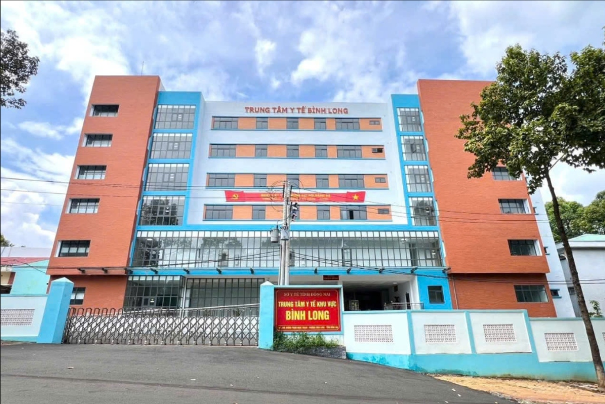
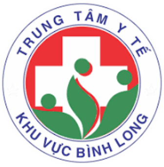
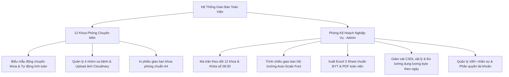

<div align="center">



<br/><br/>



# 🏥 HỆ THỐNG QUẢN LÝ, TỔNG HỢP & TRÌNH CHIẾU BÁO CÁO GIAO BAN Y TẾ TOÀN VIỆN
### **TRUNG TÂM Y TẾ KHU VỰC BÌNH LONG — SỞ Y TẾ THÀNH PHỐ ĐỒNG NAI**

<p align="center">
  <em>Giải pháp chuyển đổi số y tế toàn diện thay thế hoàn toàn báo cáo sổ sách truyền thống, phục vụ công tác giao ban chuyên môn hàng ngày cho 12 Khoa/Phòng & Phòng Kế Hoạch - Nghiệp Vụ.</em>
</p>

[](https://github.com/UIBreaker/Hospital-Report-System)
[](https://github.com/UIBreaker)
[](https://zalo.me/0916337266)
[](LICENSE)

<br/>

[](https://react.dev/)
[](https://vitejs.dev/)
[](https://nodejs.org/)
[](https://expressjs.com/)
[](https://www.mysql.com/)
[](https://aiven.io/)
[](https://cloudinary.com/)
[](https://github.com/exceljs/exceljs)
[](https://ekoopmans.github.io/html2pdf.js/)
[](https://vercel.com/)

</div>

---

## 📌 Mục Lục
- [1. Giới Thiệu & Bối Cảnh Hệ Thống](#1-giới-thiệu--bối-cảnh-hệ-thống)
- [2. Nền Tảng Công Nghệ (Tech Stack)](#2-nền-tảng-công-nghệ-tech-stack)
- [3. Tính Năng Kỹ Thuật Nổi Bật](#3-tính-năng-kỹ-thuật-nổi-bật)
- [4. Cấu Trúc Thư Mục Dự Án](#4-cấu-trúc-thư-mục-dự-án)
- [5. Thiết Kế Cơ Sở Dữ Liệu & Ràng Buộc Khóa Ngoại](#5-thiết-kế-cơ-sở-dữ-liệu--ràng-buộc-khóa-ngoại)
- [6. Hướng Dẫn Cài Đặt & Chạy Môi Trường Phát Triển](#6-hướng-dẫn-cài-đặt--chạy-môi-trường-phát-triển)
- [7. Cấu Hình Biến Môi Trường (.env)](#7-cấu-hình-biến-môi-trường-env)
- [8. Danh Mục 12 Khoa Phòng Chuyên Môn](#8-danh-mục-12-khoa-phòng-chuyên-môn)
- [9. Kế Hoạch Nâng Cấp (Roadmap)](#9-kế-hoạch-nâng-cấp-roadmap)
- [10. Tác Giả & Hỗ Trợ Kỹ Thuật](#10-tác-giả--hỗ-trợ-kỹ-thuật)

---

## 1. 🌟 Giới Thiệu & Bối Cảnh Hệ Thống

Tại các bệnh viện và trung tâm y tế, công tác **Giao ban chuyên môn ca trực sáng (07:30 - 08:30)** là hoạt động mang tính sống còn để đánh giá tình hình cấp cứu, tiếp nhận bệnh nhân, theo dõi diễn biến chuyển biến nặng, phẫu thuật khẩn cấp và tử vong trong 24 giờ qua.

**Hệ Thống Quản Lý Báo Cáo Giao Ban Trực Tuyến** được phát triển nhằm giải quyết triệt để các tồn đọng của quy trình thủ công:
* ❌ **Thực trạng cũ:** Báo cáo bằng sổ viết tay hoặc nhập Excel rời rạc, tốn 45-60 phút tổng hợp, dễ sai sót số liệu, không thể đính kèm ảnh cận lâm sàng (X-quang, CT Scanner, siêu âm), không có cơ chế khóa sổ chống sửa số liệu hồi cứu.
* ✅ **Giải pháp mới:** 12 Khoa phòng nhập liệu trực tiếp trên biểu mẫu điện tử chuyên khoa; hệ thống tự động tổng hợp số liệu toàn viện theo thời gian thực (Real-time); hỗ trợ chế độ **Trình chiếu hội trường thông minh**, **Xuất file Excel 3 Sheet** chuẩn định dạng Bộ Y Tế và **In/Xuất PDF chuẩn A4** chỉ với 1 cú click.

---

## 2. 🛡️ Nền Tảng Công Nghệ (Tech Stack)

### **Frontend Client**
* **React 18.3 & Vite 6 (Rolldown Engine):** Tối ưu hóa thời gian biên dịch Bundle (<800ms) và Hot Module Replacement (HMR).
* **Code Splitting & Lazy Loading (`React.lazy` + `Suspense`):** Tách nhỏ mã nguồn trang quản trị thành các chunk độc lập (`ReportsTab`, `StaffTab`, `DatabaseTab`, `AccountsTab`), giảm 65% dung lượng nạp ban đầu.
* **React Router v6:** Điều hướng Single Page Application (SPA) mượt mà với Route Guards bảo vệ phân quyền Admin/Department.
* **ExcelJS Client Engine:** Tạo và định dạng trực tiếp file Excel 3 Sheet chuyên nghiệp trên trình duyệt mà không gây tải cho CPU máy chủ.
* **html2pdf.js & jsPDF Engine:** Bộ xuất bản in A4 y tế chuẩn tỷ lệ phân trang thông minh, chống tràn viền và chống cắt đứt dòng chữ.
* **React Icons:** Bộ biểu tượng vector thương hiệu sắc nét (`react-icons/fa`, `react-icons/si`).

### **Backend RESTful API**
* **Node.js 20+ & Express.js 5:** Khung kiến trúc API tách lớp chuẩn mực (Controller - Service - Model - Middleware).
* **MySQL2 Connection Pool:** Quản lý kết nối cơ sở dữ liệu hiệu năng cao với cấu hình SSL đám mây.
* **JSON Web Token (JWT) & Bcrypt:** Xác thực phân quyền đa tầng, mã hóa mật khẩu một chiều với salt rounds = 10, hỗ trợ kiểm tra dự phòng CSDL chống lỗi token cũ.
* **Multer & Cloudinary SDK:** Xử lý nén và tải lên hình ảnh y khoa độ phân giải cao lên Cloud CDN với đường truyền bảo mật HTTPS.

### **Cơ Sở Dữ Liệu & Hạ Tầng Máy Chủ**
* **MySQL 8.4 Serverless (Aiven Cloud Managed DB / TiDB Cloud):** CSDL quan hệ chuẩn hóa mức 3NF, ràng buộc khóa ngoại `ON DELETE CASCADE`, chỉ mục Index tối ưu tốc độ truy vấn <10ms.
* **Vercel Serverless Edge & On-Premise VM:** Tương thích cả hạ tầng đám mây không máy chủ và máy chủ vật lý nội bộ bệnh viện.

---

## 3. ⚡ Tính Năng Kỹ Thuật Nổi Bật



### 1. Biểu Mẫu Nhập Liệu Chuyên Khoa Tự Động Hóa
* Cung cấp 12 biểu mẫu đặc thù cho từng khối (Khoa Khám bệnh, HSCC - Thận nhân tạo, Sản, Nhi, Ngoại TH, CTCH, Mắt, TMH, RHM, YHCT, GMHS, Xét nghiệm, CĐHA).
* Tự động tính toán số liệu: `Hiện còn = Bệnh cũ + Nhập viện - Xuất viện - Chuyển viện - Chuyển khoa` với cơ chế nhận diện can thiệp thủ công (Manual override).

### 2. Quản Lý 4 Nhóm Ca Bệnh Lâm Sàng Kèm Ảnh Y Khoa HD
* Quản lý chuyên sâu: **Ca Chuyển Viện**, **Ca Phẫu Thuật Mổ**, **Ca Tử Vong**, **Ca Bệnh Nặng Cần Theo Dõi**.
* Tích hợp upload nhiều hình ảnh chụp X-quang, CT Scanner, siêu âm, vết thương qua Cloudinary CDN kèm bộ xem ảnh phóng to toàn màn hình (Image Lightbox Modal).

### 3. Trình Chiếu Giao Ban Hội Trường (Presentation Engine)
* **Permanent Canvas Architecture:** Cố định khung slide nền trắng, hiệu ứng chuyển cảnh Zero-Shift Micro-Fade (`140ms`), chống hoàn toàn hiện tượng chớp nháy màn hình máy chiếu.
* **Auto-Scaling Typography:** Tự động đo độ dài văn bản chuyên môn (`contentLength`) để co giãn cỡ chữ thông minh từ `0.76rem` đến `1.65rem`, đảm bảo toàn bộ hội trường nhìn rõ mọi chi tiết ca bệnh.

### 4. Cơ Chế Khóa Sổ Toàn Viện Chống Sửa Số Liệu Hồi Cứu (`is_locked`)
* Sau mốc **08:30 sáng**, toàn bộ báo cáo tự động chuyển sang trạng thái Khóa Sổ. Khoa phòng chỉ có thể xem, không thể thay đổi dữ liệu đã chốt.
* Quản trị viên (Admin/Ban Giám Đốc) có đặc quyền tối cao: **Mở khóa từng khoa** hoặc **Mở khóa toàn viện** linh hoạt khi cần bổ sung số liệu.

### 5. Xuất File Excel 3 Sheet & In Ấn PDF Y Tế Chuẩn A4
* **ExcelJS Multi-Sheet:** Xuất file `.xlsx` gồm 3 Sheet: `Tổng Hợp Toàn Viện`, `Chi Tiết 12 Khoa Phòng`, `Danh Sách Ca Bệnh` với màu sắc nhận diện, căn lề và kẻ viền chuẩn mực.
* **In / Tải PDF A4:** Tạo tài liệu A4 hoàn chỉnh có quốc hiệu, tiêu ngữ, chữ ký Bác sĩ - Điều dưỡng trưởng tua trực.

### 6. Giám Sát Dung Lượng CSDL & Đo Lường Byte Dữ Liệu Theo Ngày
* Bảng điều khiển phân tích chi tiết dung lượng ổ đĩa vật lý Cloud Aiven (Used / Free / Total 1.0 GB).
* Đo lường chính xác dung lượng văn bản (Text KB) và hình ảnh (Image KB) phát sinh theo từng ngày của 12 khoa.

---

## 4. 📂 Cấu Trúc Thư Mục Dự Án

```text
hospital-report-system/
├── client/                               # Frontend React 18 + Vite SPA
│   ├── public/                           # Static assets (logo.png, hospital.jpg, favicon)
│   ├── src/
│   │   ├── components/
│   │   │   ├── admin/                    # Module Quản trị AdminDashboard
│   │   │   │   ├── common/               # ReportDataViewer.jsx (Render chuyên môn đệ quy)
│   │   │   │   ├── modals/               # AdminReportDetailModal, StaffFormModal, AccountFormModal
│   │   │   │   └── tabs/                 # ReportsTab, StaffTab, DatabaseTab, AccountsTab
│   │   │   ├── common/                   # MedicalPrintView, CaseImageUploader, Footer, AIAssistant
│   │   │   ├── forms/departments/        # 12 Biểu mẫu chuyên khoa (LienChuyenKhoa, San, Noi...)
│   │   │   └── ui/                       # Atomic UI System (Button, Card, Modal, Table, Notice...)
│   │   ├── config/                       # version.js, api.js
│   │   ├── contexts/                     # AuthContext.jsx (JWT Session Provider)
│   │   ├── pages/                        # LoginPage, ReportPage, AdminDashboard, PresentationPage
│   │   ├── services/                     # reportService, staffService, accountService, excelExportService
│   │   └── utils/                        # medicalDictionary, medicalFormatters
│   ├── package.json
│   └── vite.config.js
│
├── server/                               # Backend Node.js Express REST API
│   ├── src/
│   │   ├── config/                       # db.js (MySQL2 Pool SSL), cloudinary.js
│   │   ├── controllers/                  # authController, reportController, adminController, staffController
│   │   ├── middleware/                   # auth.js (JWT Multi-criteria & Fallback Auth)
│   │   ├── routes/                       # authRoutes, reportRoutes, adminRoutes, staffRoutes, accountRoutes
│   │   ├── services/                     # excelExportService.js
│   │   └── utils/                        # migrateCascade.js
│   ├── server.js                         # Express Server Entry Point
│   └── package.json
│
└── README.md                             # Tài liệu kỹ thuật dự án
```

---

## 5. 🗄️ Thiết Kế Cơ Sở Dữ Liệu & Ràng Buộc Khóa Ngoại

Cơ sở dữ liệu được thiết lập với chuẩn toàn vẹn tham chiếu `ON DELETE CASCADE` và chỉ mục Index tối ưu hóa:

```sql
-- 1. Bảng Tài khoản người dùng (users)
CREATE TABLE users (
  id INT AUTO_INCREMENT PRIMARY KEY,
  username VARCHAR(50) NOT NULL UNIQUE,
  password VARCHAR(255) NOT NULL,
  department_code VARCHAR(50) NOT NULL,
  department_name VARCHAR(100) NOT NULL,
  role ENUM('admin', 'department') DEFAULT 'department',
  created_at TIMESTAMP DEFAULT CURRENT_TIMESTAMP
);

-- 2. Bảng Báo cáo giao ban trung tâm (reports)
CREATE TABLE reports (
  id INT AUTO_INCREMENT PRIMARY KEY,
  department_code VARCHAR(50) NOT NULL,
  report_date DATE NOT NULL,
  doctor_name VARCHAR(255),
  nurse_name VARCHAR(255),
  overtime_staff JSON,
  room VARCHAR(100),
  shift_time VARCHAR(100),
  report_data JSON,
  status ENUM('draft', 'submitted') DEFAULT 'submitted',
  is_locked TINYINT(1) DEFAULT 0,
  created_at TIMESTAMP DEFAULT CURRENT_TIMESTAMP,
  updated_at TIMESTAMP DEFAULT CURRENT_TIMESTAMP ON UPDATE CURRENT_TIMESTAMP,
  UNIQUE KEY unique_dept_date (department_code, report_date)
);

-- 3. Các bảng ca bệnh đặc biệt liên kết Khóa ngoại ON DELETE CASCADE
CREATE TABLE transfer_cases (
  id INT AUTO_INCREMENT PRIMARY KEY,
  report_id INT NOT NULL,
  patient_name VARCHAR(150),
  age VARCHAR(20),
  address VARCHAR(255),
  admission_time VARCHAR(50),
  reason TEXT,
  clinical_symptoms TEXT,
  clinical_tests TEXT,
  diagnosis TEXT,
  initial_treatment TEXT,
  progress_notes TEXT,
  images JSON,
  FOREIGN KEY (report_id) REFERENCES reports(id) ON DELETE CASCADE
);

CREATE TABLE surgery_cases (
  id INT AUTO_INCREMENT PRIMARY KEY,
  report_id INT NOT NULL,
  patient_name VARCHAR(150),
  birth_year VARCHAR(20),
  address VARCHAR(255),
  admission_time VARCHAR(50),
  clinical_symptoms TEXT,
  clinical_tests TEXT,
  preoperative_diagnosis TEXT,
  consultation_order TEXT,
  postoperative_diagnosis TEXT,
  current_status TEXT,
  images JSON,
  FOREIGN KEY (report_id) REFERENCES reports(id) ON DELETE CASCADE
);

CREATE TABLE death_cases (
  id INT AUTO_INCREMENT PRIMARY KEY,
  report_id INT NOT NULL,
  patient_name VARCHAR(150),
  age VARCHAR(20),
  address VARCHAR(255),
  admission_time VARCHAR(50),
  admission_status TEXT,
  medical_history TEXT,
  clinical_symptoms TEXT,
  clinical_tests TEXT,
  diagnosis TEXT,
  emergency_treatment TEXT,
  final_outcome TEXT,
  images JSON,
  FOREIGN KEY (report_id) REFERENCES reports(id) ON DELETE CASCADE
);

CREATE TABLE critical_cases (
  id INT AUTO_INCREMENT PRIMARY KEY,
  report_id INT NOT NULL,
  patient_name VARCHAR(150),
  age VARCHAR(20),
  address VARCHAR(255),
  admission_time VARCHAR(50),
  medical_history TEXT,
  clinical_symptoms TEXT,
  clinical_tests TEXT,
  diagnosis TEXT,
  condition_summary TEXT,
  treatment TEXT,
  notes TEXT,
  images JSON,
  FOREIGN KEY (report_id) REFERENCES reports(id) ON DELETE CASCADE
);
```

---

## 6. 🚀 Hướng Dẫn Cài Đặt & Chạy Môi Trường Phát Triển

### **Yêu Cầu Tiên Quyết (Prerequisites)**
* **Node.js:** Phiên bản `>= 18.x` (Khuyên dùng LTS Node 20.x hoặc 24.x).
* **Cơ Sở Dữ Liệu:** MySQL `>= 8.0` trên máy cục bộ hoặc máy chủ Aiven Cloud MySQL / TiDB Cloud.
* **Trình duyệt:** Google Chrome, Microsoft Edge, Safari bản mới nhất.

### **Các Bước Triển Khai (Step-by-Step)**

#### **Bước 1: Clone kho mã nguồn từ GitHub**
```bash
git clone https://github.com/UIBreaker/Hospital-Report-System.git
cd Hospital-Report-System
```

#### **Bước 2: Cấu hình và khởi động Backend Máy Chủ**
```bash
cd server
npm install

# Tạo file biến môi trường .env (tham khảo mẫu mục 7)
cp .env.example .env

# Khởi chạy server ở chế độ phát triển
npm run dev
# Máy chủ sẽ lắng nghe tại: http://localhost:5000
```

#### **Bước 3: Cấu hình và khởi động Frontend Giao Diện**
```bash
# Mở một cửa sổ Terminal mới
cd ../client
npm install

# Khởi chạy giao diện với Vite HMR
npm run dev
# Ứng dụng web sẵn sàng tại: http://localhost:5173
```

---

## 7. ⚙️ Cấu Hình Biến Môi Trường (.env)

### **1. File cấu hình Server (`server/.env`)**
| Biến Môi Trường | Ý Nghĩa / Giá Trị Mẫu | Ghi Chú |
| :--- | :--- | :--- |
| `PORT` | `5000` | Cổng HTTP Server của Express |
| `DB_HOST` | `mysql-hospital-report.aivencloud.com` | Địa chỉ máy chủ CSDL MySQL |
| `DB_PORT` | `15392` | Cổng kết nối CSDL (mặc định 3306 hoặc port Cloud) |
| `DB_USER` | `avnadmin` | Tên người dùng CSDL |
| `DB_PASSWORD` | `YOUR_SECURE_PASSWORD` | Mật khẩu truy cập CSDL |
| `DB_NAME` | `hospital_report` | Tên Schema cơ sở dữ liệu |
| `DB_SSL` | `true` | Bật mã hóa kết nối SSL bắt buộc trên Cloud |
| `JWT_SECRET` | `SUPER_SECRET_KEY_HOSPITAL_2026` | Khóa bí mật ký mã hóa Token JWT |
| `JWT_EXPIRES_IN` | `30d` | Thời hạn phiên đăng nhập (30 ngày) |
| `CLOUDINARY_CLOUD_NAME` | `hospital-binh-long` | Tên Cloud lưu trữ ảnh y khoa Cloudinary |
| `CLOUDINARY_API_KEY` | `123456789012345` | Khóa API Cloudinary |
| `CLOUDINARY_API_SECRET` | `YOUR_CLOUDINARY_SECRET` | Khóa bí mật API Cloudinary |

### **2. File cấu hình Client (`client/.env`)**
| Biến Môi Trường | Ý Nghĩa / Giá Trị Mẫu | Ghi Chú |
| :--- | :--- | :--- |
| `VITE_API_URL` | `http://localhost:5000/api` | Đường dẫn kết nối API Gateway của Frontend |

---

## 8. 🏥 Danh Mục 12 Khoa Phòng Chuyên Môn

| STT | Mã Khoa (`department_code`) | Tên Khoa Phòng Đầy Đủ | Biểu Mẫu Nhập Liệu |
| :---: | :--- | :--- | :--- |
| **1** | `lck` | **Khoa Liên Chuyên Khoa** (Mắt - TMH - RHM - Da Liễu) | `LienChuyenKhoaForm.jsx` |
| **2** | `xn` | **Khoa Xét Nghiệm** | `XetNghiemForm.jsx` |
| **3** | `cdha` | **Khoa Chẩn Đoán Hình Ảnh** (X-Quang, Siêu âm, CT) | `ChuanDoanHinhAnhForm.jsx` |
| **4** | `hscc_tnt` | **Khoa Hồi Sức Cấp Cứu – Thận Nhân Tạo** (Kèm PK21) | `HoiSucCapCuuForm.jsx` |
| **5** | `noi` | **Khoa Nội Tổng Hợp** | `NoiForm.jsx` |
| **6** | `nhi` | **Khoa Nhi** | `NhiForm.jsx` |
| **7** | `nhiem` | **Khoa Truyền Nhiễm** | `NhiemForm.jsx` |
| **8** | `san` | **Khoa Sản (Chăm Sóc Sức Khỏe Sinh Sản)** | `SanForm.jsx` |
| **9** | `yhct_phcn` | **Khoa Y Học Cổ Truyền – Phục Hồi Chức Năng** | `YHocCoTruyenForm.jsx` |
| **10** | `ngoai_th` | **Khoa Ngoại Tổng Hợp** | `NgoaiTongHopForm.jsx` |
| **11** | `ctch` | **Khoa Chấn Thương Chỉnh Hình** | `ChanThuongChinhHinhForm.jsx` |
| **12** | `gmhs` | **Khoa Phẫu Thuật — Gây Mê Hồi Sức** | `GayMeHoiSucForm.jsx` |

---

## 9. 🗺️ Kế Hoạch Nâng Cấp (Roadmap)

- [x] **v1.34.3:** Chuẩn hóa cơ chế Khóa sổ toàn viện `is_locked` độc quyền kiểm soát bởi Admin.
- [x] **v1.35.0:** Tái cấu trúc Module hóa `AdminDashboard` thành 4 tab chuyên biệt với `React.lazy` & `Suspense`.
- [x] **v1.35.4:** Tối ưu hóa xuất file Excel 3 Sheet, In PDF A4 và biểu mẫu nhập liệu chuyên môn.
- [x] **v1.36.0:** Bổ sung Footer nhận diện thương hiệu y tế và trình diễn 13 công nghệ vận hành.
- [x] **v1.37.2:** Hoàn thiện tài liệu kỹ thuật chuẩn quốc tế và tinh chỉnh hiệu năng toàn diện.
- [ ] **v1.38.0 (Dự kiến):** Tích hợp WebSocket Real-time thông báo tức thì khi có khoa nộp báo cáo ca bệnh nặng.
- [ ] **v1.39.0 (Dự kiến):** Trợ lý AI phân tích tóm tắt diễn biến ca trực tự động ứng dụng Google Gemini 2.0 Flash.
- [ ] **v1.40.0 (Dự kiến):** Kết nối chuẩn y tế HL7/DICOM tích hợp trực tiếp phần mềm quản lý bệnh viện (HIS/LIS/PACS).

---

## 10. 👨‍💻 Tác Giả & Hỗ Trợ Kỹ Thuật

* **Tác giả phát triển:** **Nguyễn Vũ Nhật Nam** (Full-Stack Engineer / UI-UX Architect)
* **Tổ chức:** Phòng Kế Hoạch - Nghiệp Vụ, **Trung Tâm Y Tế Khu Vực Bình Long**
* **GitHub Repository:** [https://github.com/UIBreaker/Hospital-Report-System](https://github.com/UIBreaker/Hospital-Report-System)
* **Kênh hỗ trợ kỹ thuật trực tiếp (Hotline / Zalo):** [**0916.337.266**](https://zalo.me/0916337266)

---

<div align="center">
  <b>&copy; 2026 Trung Tâm Y Tế Khu Vực Bình Long — Sở Y Tế Thành Phố Đồng Nai. All rights reserved.</b>
</div>
