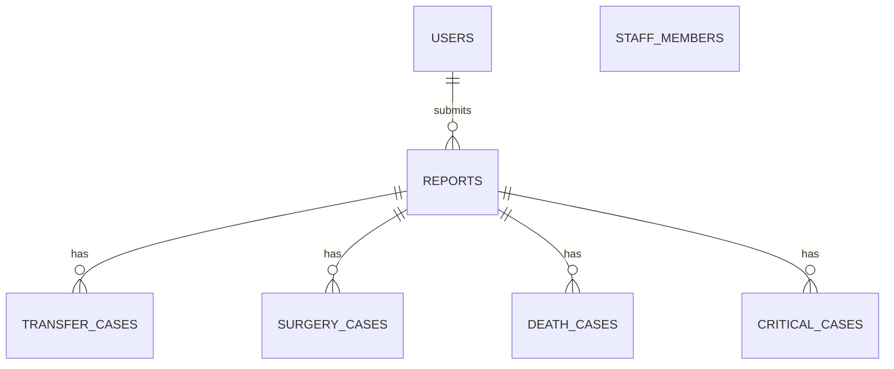

# 🏥 Hệ Thống Báo Cáo Giao Ban Trực Tuyến — TTYT Khu Vực Bình Long

<div align="center">


<br/>


### **HỆ THỐNG QUẢN LÝ, TỔNG HỢP VÀ TRÌNH CHIẾU BÁO CÁO GIAO BAN Y TẾ TOÀN DIỆN**

*Ứng dụng Web chuyển đổi số y tế toàn diện phục vụ 12 Khoa/Phòng chuyên môn & Phòng Kế Hoạch Nghiệp Vụ (KHNV) Trung Tâm Y Tế Khu Vực Bình Long.*

[](https://hospital-report-system.vercel.app/)
[-0F2C59?style=for-the-badge&logo=github)](https://github.com/UIBreaker/Hospital-Report-System)
[](https://hospital-report-system.vercel.app/)
[](LICENSE)

</div>

---

## 1. 🌟 Giới Thiệu & Bối Cảnh Dự Án

**Hệ Thống Báo Cáo Giao Ban Trực Tuyến** là giải pháp phần mềm chuyển đổi số y tế hiện đại, thay thế hoàn toàn phương thức báo cáo giao ban truyền thống bằng giấy tờ và file bảng tính rời rạc tại **Trung Tâm Y Tế Khu Vực Bình Long (Sở Y Tế Tỉnh Bình Phước)**.

Phần mềm được thiết kế đồng bộ theo chuẩn nhận diện thương hiệu y tế bệnh viện, cung cấp quy trình nhập liệu nhanh chóng cho các Bác sĩ & Điều dưỡng trực thuộc **12 khoa phòng chuyên môn**, đồng thời trang bị **Quản lý tài khoản các khoa với đổi mật khẩu tùy ý**, **Quản lý danh mục 185+ nhân sự**, **Trình chiếu hội trường có animation mượt mà**, **Quản lý đầy đủ 5 danh mục ca lâm sàng & hình ảnh y khoa HD**, **Xuất Excel đa Sheet chuyên môn (`ExcelJS`)**, **Xuất PowerPoint (.pptx) tự động**, và **Xuất Báo Cáo PDF y tế chuẩn in A4 3 phần (`html2pdf.js`)**.

---

## 2. 🛡️ Công Nghệ & Kiến Trúc Kỹ Thuật (Tech Stack)

<div align="center">


</div>

* **Frontend**:
  * **React 18** với **Vite 8** (Rolldown Bundler) tối ưu hóa tốc độ build và Hot Module Replacement.
  * **Code Splitting & Lazy Loading (`React.lazy` + `Suspense`)**: Giảm kích thước file tải ban đầu xuống chỉ còn ~325KB.
  * **React Router DOM v6** điều hướng Single Page Application mượt mà.
  * **Axios** kết nối API với Interceptor xử lý xác thực bảo mật Bearer Token.
  * **Custom Design System & CSS Variables** với tone màu chuẩn Y Tế: Navy Blue (`#0F2C59`), Medical Red (`#D32F2F`), Botanical Green (`#2E7D32`), GPU-accelerated keyframe transitions.
* **Backend**:
  * **Node.js & Express** kiến trúc RESTful API module hóa cao.
  * **MySQL2 Connection Pool** hỗ trợ kết nối bảo mật SSL đám mây (**TiDB Cloud / Aiven / Railway / XAMPP**).
  * **JSON Web Token (JWT)** xác thực bảo mật với cơ chế duy trì phiên làm việc **30 ngày**.
  * **Bcrypt** mã hóa mật khẩu một chiều tiêu chuẩn công nghiệp.

---

## 3. 📋 Danh Sách 12 Khoa/Phòng Chuyên Môn Trong Hệ Thống

| STT | Mã Khoa | Tên Khoa / Phòng | Tài Khoản Đăng Nhập | Đặc Điểm Nghiệp Vụ Chuyên Môn |
| :---: | :---: | :--- | :---: | :--- |
| **1** | `lck` | **Khoa Liên Chuyên Khoa** | `lck.bvbl` | Mắt, Tai Mũi Họng (TMH), Răng Hàm Mặt (RHM), Da Liễu |
| **2** | `xn` | **Khoa Xét nghiệm** | `xn.bvbl` | Tổng số lượt xét nghiệm, BHYT, Nội trú, Ngoại trú, Huyết học, Sinh hóa, Vi sinh |
| **3** | `cdha` | **Chẩn đoán hình ảnh** | `cdha.bvbl` | CT Scan, X-quang, Siêu âm, Nội soi, Điện tim, BS trực phòng |
| **4** | `hscc_tnt` | **Hồi sức cấp cứu – Thận nhân tạo** | `hscc.bvbl` | Khối HSCC (thở máy, CPAP, oxy), Khối Thận nhân tạo (lọc máu), Phòng khám 21 |
| **5** | `noi` | **Khoa Nội tổng hợp** | `noi.bvbl` | Khu A, Khu B, bệnh cũ, bệnh mới, xuất viện, chuyển khoa, tự động tính `Hiện còn` |
| **6** | `nhi` | **Khoa Nhi** | `nhi.bvbl` | Khám nhi, sơ sinh, thở oxy, chuyển viện, diễn biến nhi khoa |
| **7** | `nhiem` | **Khoa Truyền nhiễm** | `nhiem.bvbl` | Sốt xuất huyết, tay chân miệng, truyền nhiễm, phòng cách ly |
| **8** | `san` | **Khoa Sản** | `san.bvbl` | Sinh thường, mổ đẻ (mổ lấy thai), khám thai, cấp cứu sản khoa |
| **9** | `yhct_phcn` | **Y học cổ truyền – PHCN** | `yhct.bvbl` | Khám ngoại trú, nội trú, châm cứu, xoa bóp bấm huyệt, vật lý trị liệu |
| **10** | `ngoai_th` | **Ngoại tổng hợp** | `ngoai.bvbl` | Mổ cấp cứu, mổ chương trình, khám ngoại trú, hậu phẫu |
| **11** | `ctch` | **Chấn thương chỉnh hình** | `ctch.bvbl` | Bó bột, nẹp bất động, kết hợp xương, phẫu thuật chỉnh hình |
| **12** | `gmhs` | **Phẫu thuật, gây mê hồi sức** | `gmhs.bvbl` | Thống kê số ca mổ CC & CT (CTCH, Ngoại TH, Sản), kíp mổ, kỹ thuật viên gây mê |
| **—** | `admin` | **Phòng Kế Hoạch Nghiệp Vụ** | `Khnv` | **Quản trị viện: Quản lý báo cáo, đổi mật khẩu 12 khoa, xuất Excel/PDF, trình chiếu** |

---

## 4. ⚡ Các Tính Năng Nổi Bật Chính

### 4.1. 🛡️ Quản Lý Tài Khoản 12 Khoa Phòng & Đổi Mật Khẩu Tùy Ý (Tab Admin Mới)
* Hiển thị danh sách toàn bộ tài khoản 12 khoa phòng kèm chức năng tìm kiếm và sao chép nhanh tên đăng nhập.
* **Đổi mật khẩu tùy ý**: Cho phép Admin nhập bất kỳ mật khẩu mới nào với nút xem 👁️ Ẩn/Hiện.
* **Gợi ý mật khẩu nhanh (Quick Presets)**: `123 (Mặc định)`, `bvbl@2026`, `tênkhoa@123`, hoặc Tạo ngẫu nhiên 🎲.
* **Reset 1-Click**: Đặt lại ngay mật khẩu về `123` khi khoa phòng quên mật khẩu.

### 4.2. 📺 Trình Chiếu Giao Ban Hội Trường với Animation Mượt Mà & Phóng To Ảnh HD
* **Hiệu ứng chuyển slide thông minh (Direction-Aware)**: Trượt nhẹ nhàng theo chiều bấm (Next / Prev) đạt chuẩn **60 FPS** nhờ GPU Acceleration.
* **Tự động tạo Slide ảnh y khoa riêng biệt**: Mỗi ảnh đính kèm của ca bệnh được tạo thành 1 slide riêng có nền tối và lightbox phóng to HD.
* **Thanh tiến trình phát sáng**: Hiển thị tỷ lệ % cuộc họp giao ban.
* **Tự động cuộn danh sách slide (Auto-scroll Thumbnail Sidebar)**.
* **Phím tắt nhanh**: `Phím mũi tên / Space` (Chuyển slide), `F` (Toàn màn hình), `Esc` (Thoát).

### 4.3. 🖨️ Xuất Báo Cáo Y Tế PDF Chuẩn In A4 & Dịch 100% Tiếng Việt
* **Cấu trúc 3 Section chuẩn mực**: Section 1 (Trang bìa & Bảng tổng quan 12 khoa), Section 2 (Chỉ số chuyên môn 6 khoa/trang), Section 3 (Danh sách 4 nhóm ca bệnh & Chữ ký 3 bên).
* **Chống cắt đôi nội dung**: Áp dụng triệt để `page-break-inside: avoid` và `pagebreak.avoid` selector.
* **Tự động lặp lại tiêu đề bảng**: Thuộc tính `thead { display: table-header-group }` giúp tiêu đề cột lặp lại ở đầu mỗi trang mới.
* **Từ điển Y Tế Tiếng Việt**: Dịch 100% key code thô (`tnt_ctdk`, `boBot`, `keToa`...) sang tiếng Việt có dấu chuẩn y tế.

### 4.4. 📊 Xuất Báo Cáo Excel Tổng Hợp 3 Sheet Động (`ExcelJS`)
* **Sheet 1 ("Tổng Hợp Toàn Viện")**: Bảng tổng quan 12 khoa phòng kèm KPI cards tóm tắt.
* **Sheet 2 ("Chi Tiết Ca Trực")**: Bảng chi tiết bác sĩ, điều dưỡng, nhân sự tăng cường, buồng phòng.
* **Sheet 3 ("Chi Tiết Bệnh Lý")**: Bảng danh sách ca Chuyển viện, Ca mổ, Ca tử vong và Ca bệnh nặng theo dõi.

---

## 5. 🗄️ Cấu Trúc Cơ Sở Dữ Liệu (Database Schema)



---

## 6. 🚀 Hướng Dẫn Cài Đặt & Chạy Cục Bộ (Local Setup)

### Yêu cầu:
* **Node.js**: Phiên bản 18.x trở lên.
* **MySQL**: Phiên bản 8.0 trở lên (hoặc TiDB Cloud).

### Khởi động dự án:
```bash
# 1. Clone repository
git clone https://github.com/UIBreaker/Hospital-Report-System.git
cd Hospital-Report-System

# 2. Cài đặt và khởi chạy Backend (Terminal 1)
cd server
npm install
node server.js
# Backend chạy tại: http://localhost:3001

# 3. Cài đặt và khởi chạy Frontend (Terminal 2)
cd ../client
npm install
npm run dev
# Frontend chạy tại: http://localhost:5173
```

---

## 7. 👤 Tác Giả & Bản Quyền

* **Đơn vị công tác**: Phòng Kế Hoạch - Nghiệp Vụ, Trung Tâm Y Tế Khu Vực Bình Long (Sở Y Tế Bình Phước).
* **Tác giả phát triển**: **Nguyễn Vũ Nhật Nam** (Sinh năm 2004).
* **Email liên hệ / Hỗ trợ**: `nhatnam171217@gmail.com`
* **Mã nguồn GitHub**: [https://github.com/UIBreaker/Hospital-Report-System](https://github.com/UIBreaker/Hospital-Report-System)
* **Bản quyền**: Phát hành theo giấy phép **MIT License**.
