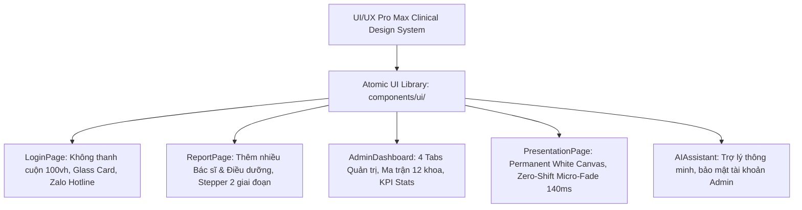

# 🏥 Hệ Thống Báo Cáo Giao Ban Trực Tuyến — TTYT Khu Vực Bình Long

<div align="center">


<br/>


### **HỆ THỐNG QUẢN LÝ, TỔNG HỢP VÀ TRÌNH CHIẾU BÁO CÁO GIAO BAN Y TẾ TOÀN DIỆN**

*Ứng dụng Web chuyển đổi số y tế toàn diện phục vụ 12 Khoa/Phòng chuyên môn & Phòng Kế Hoạch Nghiệp Vụ (KHNV) Trung Tâm Y Tế Khu Vực Bình Long.*

[](https://hospital-report-system.vercel.app/)
[-0F2C59?style=for-the-badge&logo=github)](https://github.com/UIBreaker/Hospital-Report-System)
[](https://zalo.me/0916337266)
[](https://hospital-report-system.vercel.app/)
[](LICENSE)

</div>

---

## 1. 🌟 Giới Thiệu & Bối Cảnh Dự Án

**Hệ Thống Báo Cáo Giao Ban Trực Tuyến** là giải pháp phần mềm chuyển đổi số y tế hiện đại, thay thế hoàn toàn phương thức báo cáo giao ban truyền thống bằng giấy tờ và file bảng tính rời rạc tại **Trung Tâm Y Tế Khu Vực Bình Long (Sở Y Tế Thành Phố Đồng Nai)**.

Phần mềm được thiết kế đồng bộ theo chuẩn **Clinical Design System (UI/UX Pro Max)**, cung cấp quy trình nhập liệu lâm sàng nhanh chóng cho các Bác sĩ & Điều dưỡng trực thuộc **12 khoa phòng chuyên môn**, đồng thời trang bị **Quản lý tài khoản các khoa với đổi mật khẩu tùy ý**, **Quản lý danh mục 185+ nhân sự**, **Trình chiếu hội trường Permanent Canvas chống chớp nháy**, **Quản lý đầy đủ 5 danh mục ca lâm sàng & hình ảnh y khoa HD**, **Xuất Excel đa Sheet chuyên môn (`ExcelJS`)**, **Xuất PowerPoint (.pptx) tự động**, và **Xuất Báo Cáo PDF y tế chuẩn in A4 (`html2pdf.js`)**.

---

## 2. 🚀 Các Điểm Cải Tiến & Cập Nhật Gần Đây (v1.28.x)



### 💎 2.1. Nâng Cấp Báo Cáo Khoa Phòng — Thêm Nhiều Bác Sĩ Trực Ca (`v1.28.6`)
* **Nút `+ Thêm Bác sĩ`**: Cho phép ca trực có từ 2 Bác sĩ trở lên (Bác sĩ trực chính, Bác sĩ trực phụ, Bác sĩ tăng cường) thao tác thêm/xóa linh hoạt tương tự như danh sách Điều dưỡng trực.
* **Tự động chuẩn hóa & Lưu trữ**: Hệ thống tự động phân tách và lưu danh sách bác sĩ dưới dạng chuỗi chuẩn y tế, tự động nạp lại đầy đủ khi chỉnh sửa báo cáo cũ.
* **Đồng bộ hiển thị toàn viện**: Tên các Bác sĩ trực ca xuất hiện đầy đủ trên màn hình Trình Chiếu Giao Ban, Bản In PDF và File Xuất Excel Tổng Hợp.

### 💎 2.2. Đại Tu Toàn Diện Màn Hình Đăng Nhập — Không Thanh Cuộn (`v1.28.4` - `v1.28.5`)
* **Zero-Scrollbar Lock**: Khóa chiều cao cố định `100vh` và `overflow: hidden`, đảm bảo hiển thị trọn vẹn, không bị cuộn trang trên mọi độ phân giải (Laptop 1366x768, 1080p, 2K, Tablet).
* **Atmospheric Clinical Mesh**: Nền không gian y tế chiều sâu cao cấp phối giữa xanh bóng đêm `#071328`, ánh sáng xanh lâm sàng và xanh ngọc dịu mắt.
* **Thẻ Glass Card Nổi Khối**: Bo góc 20px, viền ánh sáng tinh tế, logo nổi khối 3D kèm huy hiệu `SỞ Y TẾ THÀNH PHỐ ĐỒNG NAI`.
* **Tích hợp Thông Tin Tác Giả & Kênh Hỗ Trợ**:
  * Tác giả: [**Nguyễn Vũ Nhật Nam (UIBreaker)**](https://github.com/UIBreaker).
  * Kênh hỗ trợ kỹ thuật: [**Zalo: 0916.337.266**](https://zalo.me/0916337266) (Bấm để mở chat Zalo ngay).
  * Trạng thái CSDL: **Aiven Cloud MySQL SSL** (Chấm xanh bảo mật).

### 💎 2.3. Khắc Phục Triệt Để Chớp Nháy Trình Chiếu Hội Trường (`v1.27.4` - `v1.28.0`)
* **Kiến Trúc Permanent White Canvas**: Khung slide nền trắng được cố định vĩnh viễn (không unmount component khi chuyển slide), triệt tiêu hoàn toàn hiện tượng lộ nền tối gây chớp sáng/tối.
* **Chuyển Slide Zero-Shift Micro-Fade (`140ms`)**: Giữ nguyên vị trí chữ và bảng số liệu 100%, hiệu ứng chuyển mờ êm dịu `0.14s`, chống mỏi mắt khi Ban Giám Đốc theo dõi giao ban liên tục.
* **Xuất PowerPoint 1-Click (`pptxgenjs`)**: Tự động chuyển đổi toàn bộ báo cáo 12 khoa thành file thuyết trình Microsoft PowerPoint (`.pptx`) chuẩn tỷ lệ 16:9.

### 💎 2.4. Bảo Mật Trợ Lý Y Tế AI (`v1.28.7`)
* Ẩn lựa chọn tài khoản Quản trị viên (Admin) khỏi danh sách câu hỏi nhanh của Chatbot AI để đảm bảo tính bảo mật nội bộ của Ban Giám Đốc và Phòng KHNV.

---

## 3. 🛡️ Công Nghệ & Kiến Trúc Kỹ Thuật (Tech Stack)

<div align="center">


</div>

* **Frontend**:
  * **React 18** với **Vite 8** (Rolldown Bundler) tối ưu hóa tốc độ build (<800ms) và Hot Module Replacement.
  * **Code Splitting & Lazy Loading (`React.lazy` + `Suspense`)**: Tải từng trang theo nhu cầu sử dụng.
  * **Bộ thư viện UI Atomic nội bộ (`components/ui/index.jsx`)**: `Button`, `Card`, `Badge`, `Notice`, `Modal`, `Table`, `Tabs`, `Skeleton`, `EmptyState`, `FormField`, `Stepper`.
  * **Tabular Figures (`tabular-nums`)**: Các chữ số thẳng hàng tuyệt đối trên toàn bộ bảng số liệu.
  * **Axios** kết nối API với Interceptor xử lý xác thực bảo mật Bearer Token.
* **Backend**:
  * **Node.js & Express** kiến trúc RESTful API module hóa cao.
  * **MySQL2 Connection Pool** hỗ trợ kết nối bảo mật SSL đám mây (**Aiven Cloud MySQL SSL / TiDB Cloud**).
  * **JSON Web Token (JWT)** xác thực bảo mật với cơ chế duy trì phiên làm việc **30 ngày**.
  * **Bcrypt** mã hóa mật khẩu một chiều tiêu chuẩn công nghiệp.

---

## 4. 📋 Danh Sách 12 Khoa/Phòng Chuyên Môn Trong Hệ Thống

| STT | Mã Khoa | Tên Khoa / Phòng | Tài Khoản Đăng Nhập | Đặc Điểm Nghiệp Vụ Chuyên Môn |
| :---: | :---: | :--- | :---: | :--- |
| **1** | `lck` | **Khoa Liên Chuyên Khoa** | `lck.bvbl` | Mắt, Tai Mũi Họng (TMH), Răng Hàm Mặt (RHM), Da Liễu |
| **2** | `xn` | **Khoa Xét nghiệm** | `xn.bvbl` | Tổng số lượt xét nghiệm, BHYT, Nội trú, Ngoại trú, Huyết học, Sinh hóa, Vi sinh |
| **3** | `cdha` | **Chẩn đoán hình ảnh** | `cdha.bvbl` | CT Scan, X-quang, Siêu âm, Nội soi, Điện tim, BS trực phòng |
| **4** | `hscc_tnt` | **Hồi sức cấp cứu – Thận nhân tạo** | `hscc.bvbl` | Khối HSCC (thở máy, CPAP, oxy), Khối Thận nhân tạo (lọc máu), Phòng khám 21 |
| **5** | `noi` | **Khoa Nội tổng hợp** | `noi.bvbl` | Khu A, Khu B, bệnh cũ, bệnh mới, xuất viện, chuyển khoa, tự động tính `Hiện còn` |
| **6** | `nhi` | **Khoa Nhi** | `nhi.bvbl` | Khám nhi, sơ sinh, thở oxy, chuyển viện, diễn biến nhi khoa |
| **7** | `nhiem` | **Khoa Truyền nhiễm** | `nhiem.bvbl` | Sốt xuất huyết, tay chân miệng, truyền nhiễm, phòng cách ly |
| **8** | `san` | **Khoa Sản** | `san.bvbl` | Sinh thường, mổ đẻ (mổ lấy thai), khám thai, cấp cứu sản khoa |
| **9** | `yhct_phcn` | **Y học cổ truyền – PHCN** | `yhct.bvbl` | Khám ngoại trú, nội trú, châm cứu, xoa bóp bấm huyệt, vật lý trị liệu |
| **10** | `ngoai_th` | **Ngoại tổng hợp** | `ngoai.bvbl` | Mổ cấp cứu, mổ chương trình, khám ngoại trú, hậu phẫu |
| **11** | `ctch` | **Chấn thương chỉnh hình** | `ctch.bvbl` | Bó bột, nẹp bất động, kết hợp xương, phẫu thuật chỉnh hình |
| **12** | `gmhs` | **Phẫu thuật, gây mê hồi sức** | `gmhs.bvbl` | Thống kê số ca mổ CC & CT (CTCH, Ngoại TH, Sản), kíp mổ, kỹ thuật viên gây mê |
| **—** | `admin` | **Phòng Kế Hoạch Nghiệp Vụ** | `Khnv` | **Quản trị viện: Quản lý báo cáo, đổi mật khẩu 12 khoa, xuất Excel/PDF, trình chiếu** |

---

## 5. ⚡ Các Tính Năng Nghiệp Vụ Trọng Tâm

### 5.1. 🛡️ Quản Lý Toàn Diện Trong Bảng Điều Khiển Admin (4 Tabs)
* **Tab 1: Báo Cáo Giao Ban**: Ma trận 12 khoa phòng kèm huy hiệu Đã nộp/Chưa nộp, xem chi tiết, chỉnh sửa số liệu và duyệt báo cáo.
* **Tab 2: Quản Lý Nhân Sự (185+ cán bộ)**: Tìm kiếm tức thì, lọc theo khoa phòng và chức danh (Bác sĩ, Điều dưỡng, Kỹ thuật viên), thêm/sửa/xóa nhân sự.
* **Tab 3: Quản Lý Database**: Theo dõi dung lượng bảng, số lượng bản ghi và trạng thái kết nối Cloud MySQL SSL.
* **Tab 4: Quản Lý Tài Khoản 12 Khoa**: Đổi mật khẩu tùy ý, gợi ý mật khẩu nhanh 1-Click, reset mật khẩu về `123`.

### 5.2. 📺 Trình Chiếu Giao Ban Hội Trường (Permanent Canvas & Micro-Fade)
* **Sân khấu trình chiếu 16:9 sắc nét**: Tối ưu hiển thị cho máy chiếu hội trường và màn hình LED 4K.
* **Permanent Canvas**: Nền thẻ trắng cố định vĩnh viễn, chuyển cảnh mờ siêu êm **140ms** không chớp nháy.
* **Điều khiển chuyên nghiệp**: Phím tắt `← / → / Space`, `F` (Toàn màn hình), dock điều chỉnh cỡ chữ `80% - 180%`.
* **Xuất PowerPoint (.pptx)**: Tạo file slide chuẩn hóa tự động phục vụ lưu trữ và thuyết trình ngoại tuyến.

### 5.3. 🖨️ Mẫu In & Xuất Báo Cáo PDF Chuẩn A4
* Bố cục 3 phần chuẩn y tế: Bảng tổng quan 12 khoa $\rightarrow$ Chỉ số chuyên môn $\rightarrow$ Danh sách ca bệnh & Chữ ký 3 bên.
* Chống tràn trang, chống cắt đôi hàng bảng (`page-break-inside: avoid`), dịch 100% thuật ngữ y khoa tiếng Việt.

### 5.4. 📊 Xuất Báo Cáo Excel Đa Sheet Động (`ExcelJS`)
* Tự động sinh file Excel định dạng chuyên nghiệp với 3 Sheet: *Tổng Hợp Toàn Viện*, *Chi Tiết Ca Trực*, *Chi Tiết Bệnh Lý*.

---

## 6. 🚀 Hướng Dẫn Cài Đặt & Chạy Cục Bộ (Local Setup)

### Yêu cầu:
* **Node.js**: Phiên bản 18.x trở lên.
* **MySQL**: Phiên bản 8.0 trở lên (hoặc Aiven / TiDB Cloud).

### Khởi động dự án:
```bash
# 1. Clone repository
git clone https://github.com/UIBreaker/Hospital-Report-System.git
cd Hospital-Report-System

# 2. Cài đặt và khởi chạy Backend (Terminal 1)
cd server
npm install
node server.js
# Backend chạy tại: http://localhost:3001

# 3. Cài đặt và khởi chạy Frontend (Terminal 2)
cd ../client
npm install
npm run dev
# Frontend chạy tại: http://localhost:5173
```

---

## 7. 📜 Lịch Sử Phiên Bản (Changelog)

* **`v1.29.3` (17/08/2026)**:
  * Cập nhật thông tin đơn vị chủ quản từ **Sở Y Tế Tỉnh Bình Phước** sang **Sở Y Tế Thành Phố Đồng Nai** đồng bộ trên toàn bộ hệ thống (Màn hình Đăng nhập, Chân trang Footer, Xuất Báo cáo Excel, Xuất PowerPoint, Bản In Y Tế PDF).
* **`v1.29.2` (16/08/2026)**:
  * Ẩn hoàn toàn nút **"Phóng to toàn màn hình (HD Lightbox)"** ở các slide trình chiếu hình ảnh lâm sàng theo yêu cầu, tinh gọn bố cục giao diện trình chiếu báo cáo.
* **`v1.29.1` (16/08/2026)**:
  * Khắc phục triệt để lỗi màn hình trắng khi bấm **"Phóng to toàn màn hình (HD Lightbox)"** trong trang trình chiếu Presentation (`ImageLightboxModal`) bằng cách bổ sung đầy đủ hàm điều khiển toàn màn hình, tải ảnh gốc và kiểm tra `mounted` an toàn.
  * Sửa lỗi thiếu import icon `FaEyeSlash` gây crash trắng trang khi bấm nút **"Đổi Mật Khẩu"** trong mục Quản Lý Tài Khoản Khoa Phòng, đồng thời bọc React Portal cho tất cả Modal quản trị.
* **`v1.29.0` (15/08/2026)**:
  * **Tái cấu trúc Tab Quản Lý Database**:
    * Thay thế widget dung lượng logic cũ bằng **Dung Lượng Ổ Đĩa Aiven (Physical Storage)** với thanh trạng thái cảnh báo an toàn 3 mức (Xanh lá < 70%, Cam/Vàng 70-85%, Đỏ > 85%).
    * Tích hợp công cụ **Đo Dung Lượng Báo Cáo Theo Ngày Của Từng Khoa** (`/api/admin/reports-payload-size`), phân tích chi tiết dung lượng văn bản (KB), dung lượng ảnh (KB) và tỷ lệ % phát sinh trong ngày.
* **`v1.28.11` (15/08/2026)**:
  * Khắc phục triệt để việc xóa báo cáo không giải phóng dung lượng bằng cách xóa liên hoàn (cascade) toàn bộ ca lâm sàng con (`death_cases`, `transfer_cases`, `surgery_cases`, `critical_cases`) và chạy `OPTIMIZE TABLE` thu hồi không gian đĩa tức thì.
* **`v1.28.10` (15/08/2026)**:
  * Tự động làm mới thống kê InnoDB (`ANALYZE TABLE`) và tính chính xác `COUNT(*)` số dòng thực tế ở trang Quản Lý Database, cập nhật dung lượng ảnh và bản ghi mới tức thì.
* **`v1.28.9` (15/08/2026)**:
  * Sửa lỗi Modal xác nhận nộp báo cáo bị trôi/lệch khỏi tầm nhìn bằng cơ chế **React Portal (`createPortal`)** gắn trực tiếp vào `document.body`.
* **`v1.28.8` (15/08/2026)**:
  * Sửa lỗi menu dropdown **"Xuất Báo Cáo"** bị che/cắt góc ở bảng điều khiển Admin bằng cách thiết lập `overflow: visible !important` và nâng `z-index`.
* **`v1.28.7` (15/08/2026)**:
  * Ẩn lựa chọn tài khoản Quản trị viên (Admin) khỏi gợi ý Chatbot AI để tăng cường bảo mật.
* **`v1.28.6` (15/08/2026)**:
  * Hỗ trợ thêm nhiều **Bác sĩ trực ca** (nút `+ Thêm Bác sĩ`) tương tự như phần thêm điều dưỡng trực.
* **`v1.28.5` (15/08/2026)**:
  * Chuyển đổi kênh liên hệ tác giả sang **Zalo: 0916.337.266** (kèm link mở Zalo trực tiếp).
* **`v1.28.4` (15/08/2026)**:
  * Khóa màn hình Đăng Nhập `100vh` không thanh cuộn (**Zero-Scrollbar Lock**), tích hợp thông tin tác giả và CSDL Aiven vào thẻ đăng nhập.
* **`v1.28.0` - `v1.28.2` (15/08/2026)**:
  * Đại tu toàn diện giao diện theo tiêu chuẩn **UI/UX Pro Max** (Clinical Design System, Tabular Figures, Glass Card).
* **`v1.27.4` (14/08/2026)**:
  * Khắc phục triệt để lỗi chớp nháy chuyển slide bằng kiến trúc **Permanent White Canvas** và **Zero-Shift Micro-Fade (`140ms`)**.
* **`v1.26.0` (09/08/2026)**:
  * Tích hợp xuất PowerPoint (.pptx) và bộ từ điển dịch bảng in PDF tiếng Việt.

---

## 8. 👤 Tác Giả & Bản Quyền

* **Đơn vị công tác**: Phòng Kế Hoạch - Nghiệp Vụ, Trung Tâm Y Tế Khu Vực Bình Long (Sở Y Tế Thành Phố Đồng Nai).
* **Tác giả phát triển**: **Nguyễn Vũ Nhật Nam** (Sinh năm 2004).
* **Kênh hỗ trợ / Zalo**: [**0916.337.266**](https://zalo.me/0916337266)
* **Email liên hệ**: `nhatnam171217@gmail.com`
* **Mã nguồn GitHub**: [https://github.com/UIBreaker/Hospital-Report-System](https://github.com/UIBreaker/Hospital-Report-System)
* **Bản quyền**: Phát hành theo giấy phép **MIT License**.
